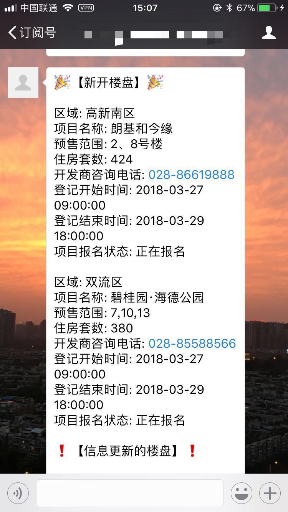

## 成都商品房摇号楼盘爬虫

## 数据来源:

<http://171.221.172.13:8888/lottery/accept/projectList>


## 使用说明

运行项目前, 有四个环境变量需要配置

### 必须配置的环境变量

* `DATABASE_URL`: 设置保存数据的数据库路径，比如: `sqlite:////path/to/db.sqlite`

### 可选环境变量

* `SLACK_WEBHOOK_URL`: Slack的`web hook url`, 用于通过slack来推送房源信息

* `WECHAT_APP_ID`: 微信公众号的`appid`, 用于通过微信公众号来推送房源信息
* `WECHAT_APP_SECRET`: 微信公众号的`appsecret`
用于通过微信公众号来推送房源信息


## 运行代码

```bash
# 配置保存爬取数据的数据库地址
$ export DATABASE_URL='sqlite:////data/house.sqlite'

# slack和微信公众号可以任意选择需要配置哪一种，也可以都配置，也可以都不配置
$ export SLACK_WEBHOOK_URL='xxxxxxxxxxxxxxxxxxxxx'
$ export WECHAT_APP_ID='xxxxxxxxxxxxxxxxxxxxx'
$ export WECHAT_APP_SECRET='xxxxxxxxxxxxxxxxxxxxx'

# 安装依赖
$ pipenv install

# 运行爬虫
$ pipenv run scrapy crawl cdfangxie
```

## 以docker的方式运行

```bash
# 配置保存爬取数据的数据库地址
$ export DATABASE_URL='sqlite:////data/house.sqlite'
# slack和微信公众号可以任意选择需要配置哪一种，也可以都配置，也可以都不配置
$ export SLACK_WEBHOOK_URL='xxxxxxxxxxxxxxxxxxxxx'
$ export WECHAT_APP_ID='xxxxxxxxxxxxxxxxxxxxx'
$ export WECHAT_APP_SECRET='xxxxxxxxxxxxxxxxxxxxx'

# 构建docker镜像
$ docker-compose build --force-rm

# 运行爬虫服务
$ docker-compose run -e DATABASE_URL=${DATABASE_URL} -e SLACK_WEBHOOK_URL=${SLACK_WEBHOOK_URL} -e WECHAT_APP_ID=${WECHAT_APP_ID} -e WECHAT_APP_SECRET=${WECHAT_APP_SECRET} crawler
```

**注意**:
可以根据自己的需要，周期性运行爬虫

### 效果图


